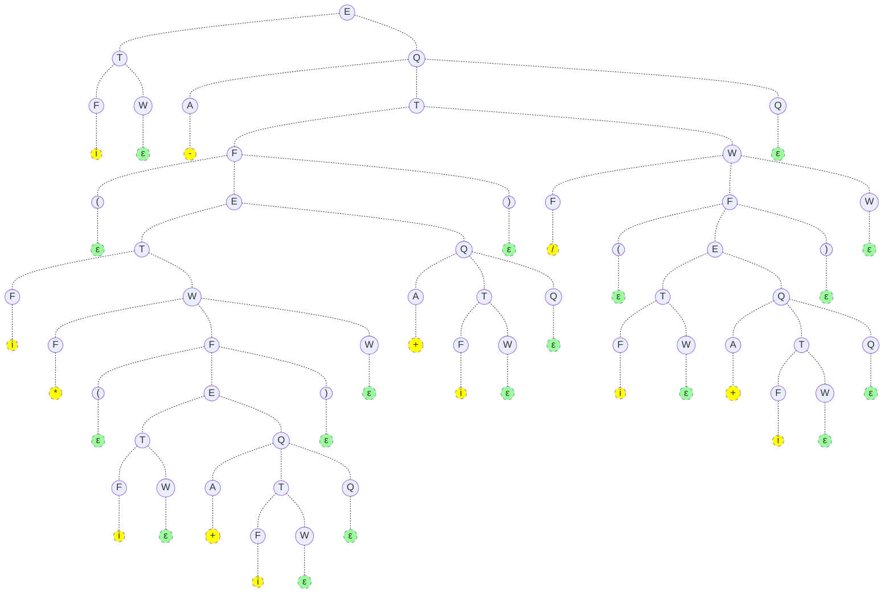

```mermaid
graph TB
E0(("E"))-.-T0(("T"))
T0(("T"))-.-F0(("F"))
F0(("F"))-.-i0(("i"))
style i0 fill:#FFFF00,stroke-dasharray: 5 5
T0(("T"))-.-W0(("W"))
W0(("W"))-.-ε0((ε))
style ε0 fill:#9AFF9A,stroke-dasharray: 5 5
E0(("E"))-.-Q0(("Q"))
Q0(("Q"))-.-A0(("A"))
A0(("A"))-.-minus0(("-"))
style minus0 fill:#FFFF00,stroke-dasharray: 5 5
Q0(("Q"))-.-T2(("T"))
T2(("T"))-.-F2(("F"))
F2(("F"))-.-LB0(("("))
LB0(("("))-.-ε1((ε))
style ε1 fill:#9AFF9A,stroke-dasharray: 5 5
F2(("F"))-.-E1(("E"))
E1(("E"))-.-T3(("T"))
T3(("T"))-.-F3(("F"))
F3(("F"))-.-i2(("i"))
style i2 fill:#FFFF00,stroke-dasharray: 5 5
T3(("T"))-.-W2(("W"))
W2(("W"))-.-F5(("F"))
F5(("F"))-.-*0(("*"))
style *0 fill:#FFFF00,stroke-dasharray: 5 5
W2(("W"))-.-F7(("F"))
F7(("F"))-.-LB2(("("))
LB2(("("))-.-ε2((ε))
style ε2 fill:#9AFF9A,stroke-dasharray: 5 5
F7(("F"))-.-E2(("E"))
E2(("E"))-.-T4(("T"))
T4(("T"))-.-F8(("F"))
F8(("F"))-.-i4(("i"))
style i4 fill:#FFFF00,stroke-dasharray: 5 5
T4(("T"))-.-W3(("W"))
W3(("W"))-.-ε3((ε))
style ε3 fill:#9AFF9A,stroke-dasharray: 5 5
E2(("E"))-.-Q1(("Q"))
Q1(("Q"))-.-A2(("A"))
A2(("A"))-.-+0(("+"))
style +0 fill:#FFFF00,stroke-dasharray: 5 5
Q1(("Q"))-.-T6(("T"))
T6(("T"))-.-F10(("F"))
F10(("F"))-.-i6(("i"))
style i6 fill:#FFFF00,stroke-dasharray: 5 5
T6(("T"))-.-W5(("W"))
W5(("W"))-.-ε4((ε))
style ε4 fill:#9AFF9A,stroke-dasharray: 5 5
Q1(("Q"))-.-Q2(("Q"))
Q2(("Q"))-.-ε5((ε))
style ε5 fill:#9AFF9A,stroke-dasharray: 5 5
F7(("F"))-.-RB0((")"))
RB0((")"))-.-ε6((ε))
style ε6 fill:#9AFF9A,stroke-dasharray: 5 5
W2(("W"))-.-W7(("W"))
W7(("W"))-.-ε7((ε))
style ε7 fill:#9AFF9A,stroke-dasharray: 5 5
E1(("E"))-.-Q5(("Q"))
Q5(("Q"))-.-A4(("A"))
A4(("A"))-.-+2(("+"))
style +2 fill:#FFFF00,stroke-dasharray: 5 5
Q5(("Q"))-.-T9(("T"))
T9(("T"))-.-F13(("F"))
F13(("F"))-.-i8(("i"))
style i8 fill:#FFFF00,stroke-dasharray: 5 5
T9(("T"))-.-W10(("W"))
W10(("W"))-.-ε8((ε))
style ε8 fill:#9AFF9A,stroke-dasharray: 5 5
Q5(("Q"))-.-Q6(("Q"))
Q6(("Q"))-.-ε9((ε))
style ε9 fill:#9AFF9A,stroke-dasharray: 5 5
F2(("F"))-.-RB2((")"))
RB2((")"))-.-ε10((ε))
style ε10 fill:#9AFF9A,stroke-dasharray: 5 5
T2(("T"))-.-W12(("W"))
W12(("W"))-.-F16(("F"))
F16(("F"))-.-/0(("/"))
style /0 fill:#FFFF00,stroke-dasharray: 5 5
W12(("W"))-.-F18(("F"))
F18(("F"))-.-LB4(("("))
LB4(("("))-.-ε11((ε))
style ε11 fill:#9AFF9A,stroke-dasharray: 5 5
F18(("F"))-.-E5(("E"))
E5(("E"))-.-T11(("T"))
T11(("T"))-.-F19(("F"))
F19(("F"))-.-i10(("i"))
style i10 fill:#FFFF00,stroke-dasharray: 5 5
T11(("T"))-.-W13(("W"))
W13(("W"))-.-ε12((ε))
style ε12 fill:#9AFF9A,stroke-dasharray: 5 5
E5(("E"))-.-Q9(("Q"))
Q9(("Q"))-.-A6(("A"))
A6(("A"))-.-+4(("+"))
style +4 fill:#FFFF00,stroke-dasharray: 5 5
Q9(("Q"))-.-T13(("T"))
T13(("T"))-.-F21(("F"))
F21(("F"))-.-i12(("i"))
style i12 fill:#FFFF00,stroke-dasharray: 5 5
T13(("T"))-.-W15(("W"))
W15(("W"))-.-ε13((ε))
style ε13 fill:#9AFF9A,stroke-dasharray: 5 5
Q9(("Q"))-.-Q10(("Q"))
Q10(("Q"))-.-ε14((ε))
style ε14 fill:#9AFF9A,stroke-dasharray: 5 5
F18(("F"))-.-RB4((")"))
RB4((")"))-.-ε15((ε))
style ε15 fill:#9AFF9A,stroke-dasharray: 5 5
W12(("W"))-.-W17(("W"))
W17(("W"))-.-ε16((ε))
style ε16 fill:#9AFF9A,stroke-dasharray: 5 5
Q0(("Q"))-.-Q13(("Q"))
Q13(("Q"))-.-ε17((ε))
style ε17 fill:#9AFF9A,stroke-dasharray: 5 5
```