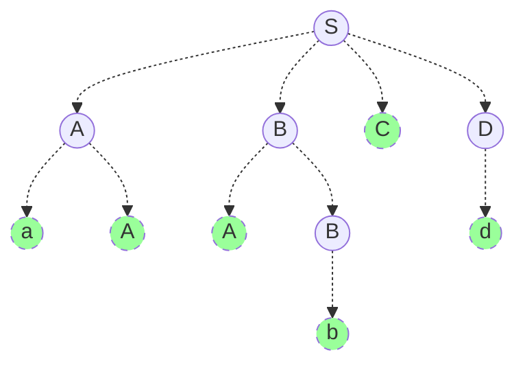

```mermaid
graph TB
S0((S))-.->A0((A))
A0((A))-.->a0((a))
style a0 fill:#9AFF9A,stroke-dasharray: 5 5
A0((A))-.->A1((A))
style A1 fill:#9AFF9A,stroke-dasharray: 5 5
S0((S))-.->B0((B))
B0((B))-.->A2((A))
style A2 fill:#9AFF9A,stroke-dasharray: 5 5
B0((B))-.->B1((B))
B1((B))-.->b0((b))
style b0 fill:#9AFF9A,stroke-dasharray: 5 5
S0((S))-.->C0((C))
style C0 fill:#9AFF9A,stroke-dasharray: 5 5
S0((S))-.->D0((D))
D0((D))-.->d0((d))
style d0 fill:#9AFF9A,stroke-dasharray: 5 5
```