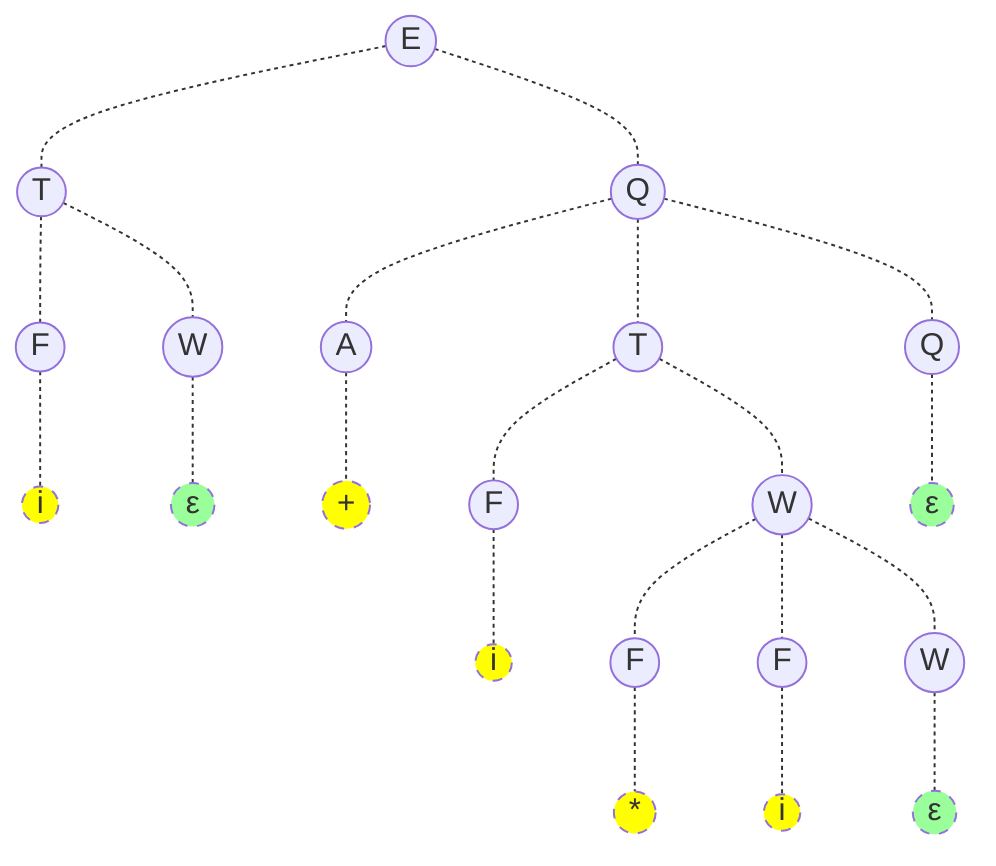

```mermaid
graph TB
E0((E))-.-T0((T))
T0((T))-.-F0((F))
F0((F))-.-i0((i))
style i0 fill:#FFFF00,stroke-dasharray: 5 5
T0((T))-.-W0((W))
W0((W))-.-ε0((ε))
style ε0 fill:#9AFF9A,stroke-dasharray: 5 5
E0((E))-.-Q0((Q))
Q0((Q))-.-A0((A))
A0((A))-.-+0((+))
style +0 fill:#FFFF00,stroke-dasharray: 5 5
Q0((Q))-.-T2((T))
T2((T))-.-F2((F))
F2((F))-.-i2((i))
style i2 fill:#FFFF00,stroke-dasharray: 5 5
T2((T))-.-W2((W))
W2((W))-.-F4((F))
F4((F))-.-*0((*))
style *0 fill:#FFFF00,stroke-dasharray: 5 5
W2((W))-.-F6((F))
F6((F))-.-i4((i))
style i4 fill:#FFFF00,stroke-dasharray: 5 5
W2((W))-.-W3((W))
W3((W))-.-ε1((ε))
style ε1 fill:#9AFF9A,stroke-dasharray: 5 5
Q0((Q))-.-Q1((Q))
Q1((Q))-.-ε2((ε))
style ε2 fill:#9AFF9A,stroke-dasharray: 5 5


```