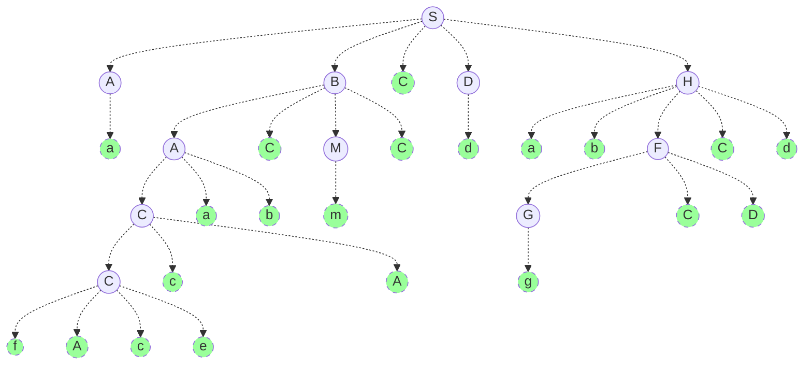

```mermaid
graph TB
S0((S))-.->A0((A))
A0((A))-.->a0((a))
style a0 fill:#9AFF9A,stroke-dasharray: 5 5
S0((S))-.->B0((B))
B0((B))-.->A1((A))
A1((A))-.->C0((C))
C0((C))-.->C1((C))
C1((C))-.->f0((f))
style f0 fill:#9AFF9A,stroke-dasharray: 5 5
C1((C))-.->A2((A))
style A2 fill:#9AFF9A,stroke-dasharray: 5 5
C1((C))-.->c0((c))
style c0 fill:#9AFF9A,stroke-dasharray: 5 5
C1((C))-.->e0((e))
style e0 fill:#9AFF9A,stroke-dasharray: 5 5
C0((C))-.->c1((c))
style c1 fill:#9AFF9A,stroke-dasharray: 5 5
C0((C))-.->A3((A))
style A3 fill:#9AFF9A,stroke-dasharray: 5 5
A1((A))-.->a1((a))
style a1 fill:#9AFF9A,stroke-dasharray: 5 5
A1((A))-.->b0((b))
style b0 fill:#9AFF9A,stroke-dasharray: 5 5
B0((B))-.->C2((C))
style C2 fill:#9AFF9A,stroke-dasharray: 5 5
B0((B))-.->M0((M))
M0((M))-.->m0((m))
style m0 fill:#9AFF9A,stroke-dasharray: 5 5
B0((B))-.->C3((C))
style C3 fill:#9AFF9A,stroke-dasharray: 5 5
S0((S))-.->C4((C))
style C4 fill:#9AFF9A,stroke-dasharray: 5 5
S0((S))-.->D0((D))
D0((D))-.->d0((d))
style d0 fill:#9AFF9A,stroke-dasharray: 5 5
S0((S))-.->H0((H))
H0((H))-.->a2((a))
style a2 fill:#9AFF9A,stroke-dasharray: 5 5
H0((H))-.->b1((b))
style b1 fill:#9AFF9A,stroke-dasharray: 5 5
H0((H))-.->F0((F))
F0((F))-.->G0((G))
G0((G))-.->g0((g))
style g0 fill:#9AFF9A,stroke-dasharray: 5 5
F0((F))-.->C5((C))
style C5 fill:#9AFF9A,stroke-dasharray: 5 5
F0((F))-.->D1((D))
style D1 fill:#9AFF9A,stroke-dasharray: 5 5
H0((H))-.->C6((C))
style C6 fill:#9AFF9A,stroke-dasharray: 5 5
H0((H))-.->d1((d))
style d1 fill:#9AFF9A,stroke-dasharray: 5 5
```