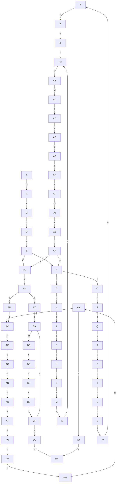

## 正规式：Go(((Java)|(Python))MySQL)*((Huang)+|(Wei)+)
>K={A,B,C,D,E,F,G,H,I,J,K,L,M,N,O,P,Q,R,S,T,U,V,W,X,Y,Z,AA,AB,AC,AD,AE,AF,AG,AH,AI,AJ,AK,AL,AM,AN,AO,AP,AQ,AR,AS,AT,AU,AV,AW,AX,AY,AZ,BA,BB,BC,BD,BE,BF,BG,BH};
Σ={G,H,J,L,M,P,Q,S,W,a,e,g,h,i,n,o,t,u,v,y,ε};
F={
    &emsp;δ(A,G)=[B],
    &emsp;δ(B,ε)=[C],
    &emsp;δ(C,o)=[D],
    &emsp;δ(D,ε)=[E],
    &emsp;δ(E,ε)=[F, AL],
    &emsp;δ(F,ε)=[G, O],
    &emsp;δ(G,J)=[H],
    &emsp;δ(H,ε)=[I],
    &emsp;δ(I,a)=[J],
    &emsp;δ(J,ε)=[K],
    &emsp;δ(K,v)=[L],
    &emsp;δ(L,ε)=[M],
    &emsp;δ(M,a)=[N],
    &emsp;δ(N,ε)=[AA],
    &emsp;δ(O,P)=[P],
    &emsp;δ(P,ε)=[Q],
    &emsp;δ(Q,y)=[R],
    &emsp;δ(R,ε)=[S],
    &emsp;δ(S,t)=[T],
    &emsp;δ(T,ε)=[U],
    &emsp;δ(U,h)=[V],
    &emsp;δ(V,ε)=[W],
    &emsp;δ(W,o)=[X],
    &emsp;δ(X,ε)=[Y],
    &emsp;δ(Y,n)=[Z],
    &emsp;δ(Z,ε)=[AA],
    &emsp;δ(AA,ε)=[AB],
    &emsp;δ(AB,M)=[AC],
    &emsp;δ(AC,ε)=[AD],
    &emsp;δ(AD,y)=[AE],
    &emsp;δ(AE,ε)=[AF],
    &emsp;δ(AF,S)=[AG],
    &emsp;δ(AG,ε)=[AH],
    &emsp;δ(AH,Q)=[AI],
    &emsp;δ(AI,ε)=[AJ],
    &emsp;δ(AJ,L)=[AK],
    &emsp;δ(AK,ε)=[F, AL],
    &emsp;δ(AL,ε)=[AM],
    &emsp;δ(AM,ε)=[AN, AZ],
    &emsp;δ(AN,ε)=[AO],
    &emsp;δ(AO,H)=[AP],
    &emsp;δ(AP,ε)=[AQ],
    &emsp;δ(AQ,u)=[AR],
    &emsp;δ(AR,ε)=[AS],
    &emsp;δ(AS,a)=[AT],
    &emsp;δ(AT,ε)=[AU],
    &emsp;δ(AU,n)=[AV],
    &emsp;δ(AV,ε)=[AW],
    &emsp;δ(AW,g)=[AX],
    &emsp;δ(AX,ε)=[AO, AY],
    &emsp;δ(AY,ε)=[BH],
    &emsp;δ(AZ,ε)=[BA],
    &emsp;δ(BA,W)=[BB],
    &emsp;δ(BB,ε)=[BC],
    &emsp;δ(BC,e)=[BD],
    &emsp;δ(BD,ε)=[BE],
    &emsp;δ(BE,i)=[BF],
    &emsp;δ(BF,ε)=[BA, BG],
    &emsp;δ(BG,ε)=[BH],
};
S={A};
Z={BH}
