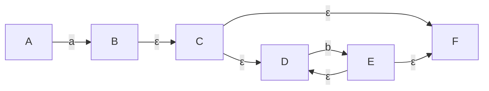

>K={A,B,C,D,E,F};
Σ={a,b,ε};
F={
    δ(A,a)=[B],
    δ(B,ε)=[C],
    δ(C,ε)=[D, F],
    δ(D,b)=[E],
    δ(E,ε)=[D, F],
};
S=[A];
Z={F}

```mermaid
graph LR

A-->|a|B
B-->|ε|C
C-->|ε|D
C-->|ε|F
D-->|b|E
E-->|ε|D
E-->|ε|F
```